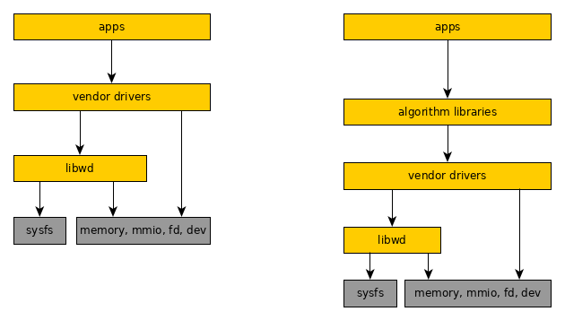
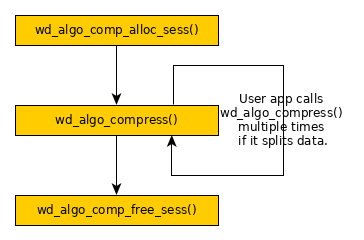
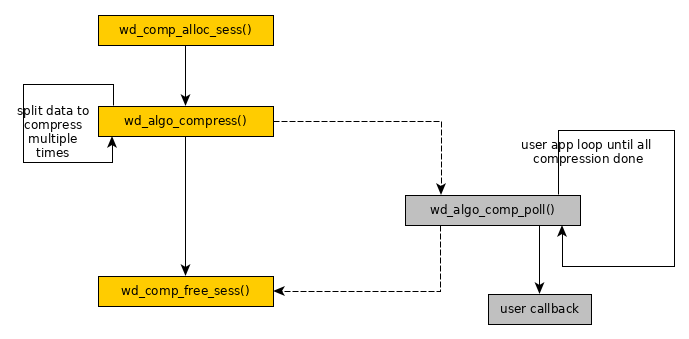

# WarpDrive Architecture Design


| Version | Author | Changes |
| --- | :---- | :---- |
|  0.91   | Haojian Zhuang |1) Remove the content of 3rd party memory  |
|         | Zhou Wang      |   allocation. |
|         |                |2) Remove "ss_va" and "ss_dma" from struct wd_chan.|
|         |                |3) Change to user app polling async interface.  |
|         |                |4) Add examples.  |
|  0.92   |                |1) Reorganize the document. |
|         |                |2) Remove some structures that are unused in apps. |
|  0.93   |                |1) Avoid to discuss whether IOMMU disabled in NOSVA |
|         |                |   scenario since it's not important. |
|         |                |2) Remove multiple queue since it's transparent to |
|         |                |   user application. |
|  0.94   |                |1) Split WarpDrive into UACCE, libwd, algorithm |
|         |                |   libraries and libaffinity. Change doc according |
|         |                |   to this notion. |
|         |                |2) Illustrate how to select hardware accelerator. |
|         |                |3) Illustrate how libaffinity working. |
|  0.95   |                |1) Remove libaffinity extension for unclear logic. |
|         |                |2) Add API to identify NOSVA in libwd. |
|  0.96   |                |1) Fix on asynchronous operation. |
|  0.97   |                |1) Fix the missing hook of async poll. |
|         |                |2) Illustrate more on binding driver. |
|  0.98   |                |1) Do not expose context to user application. Use |
|         |                |   handler instead. |
|         |                |2) Illustrate each parameter or field in table. |
|         |                |3) Adjust the layout. |
|  0.99   |                |1) Fix the parameters in wd_alg_compress() and |
|         |                |   wd_alg_decompress(). |
|  0.100  |                |1) Remove wd_get_domain_affinity() for no benefit. |
|         |                |2) Remove dev_list from struct wd_alg_comp_ctx |
|         |                |   since only one device is meaningful. |
|         |                |3) Rename context to session. Rename channel to |
|         |                |   context. |
|         |                |4) Remove tag_id for not used. |
|         |                |5) Fix in struct wd_comp_arg. |
|         |                |6) Add compression interface for stream mode. |
|         |                |7) Simplify the parameters in wd_drv_unmap_qfr(). |
|         |                |8) Append a new image for asynchronous mode. |
|  0.101  |                |1) Make libwd used by application directly. |
|         |                |   Application could either use algorithm library |
|         |                |   or libwd. |
|         |                |2) Change affinity to accel. |
|         |                |3) Adjust the layout. |
|         |                |4) Drop the concept of session. |
|  0.102  |                |1) Make libwd used by vendor driver only. |
|         |                |2) Add session back for algorithm libraries. |
|  0.103  |                |1) Remove the device list in compression algorithm |
|         |                |   library since it's just an interim state. |
|         |                |2) Fix typo error. |
|         |                |3) Add context as parameter of wd_is_nosva(). |
|         |                |4) Adjust the layout. |
|  0.104  |                |1) Merge libaccel into libwd. |
|  0.105  |                |1) Add parameter in callback for async mode. |
|         |                |2) Fix minor issues. |


## Terminology

| Term | Illustration |
| :-- | :-- |
| SVA             | Shared Virtual Addressing |
| NUMA            | Non Uniform Memory Access |
| Context         | A dual directional hardware communication resource between |
|                 | CPU and hardware accelerator. |
| IOMMU           | Input Output Memory Management Unit |


## Overview

WarpDrive is a framework for user application to access hardware accelerator 
in a unified, secure, and efficient way. WarpDrive is comprised of UACCE, 
libwd and many other algorithm libraries for different applications.



Libwd provides a wrapper of basic UACCE user space interfaces, they will be a 
set of helper functions.

Algorithm libraries offer a set of APIs to users, who could use this set of 
APIs to do specific task without accessing low level implementations. Algorithm 
libraries also offer a register interface to let hardware vendors to register 
their own user space driver, which could use above helper functions to do UACCE 
related work.

So two mechanisms are provided to user application. User application could 
either access libwd or algorithm libraries.

This document focuses on the design of libwd and algorithm libraries.


## Based Technology

WarpDrive relies on SVA (Shared Virtual Address) that needs to be supported 
by IOMMU.

In WarpDrive framework, virtual address could be used by vendor driver and 
application directly. And it's actually the same virtual address, memory copy 
could be avoided between vendor driver and application.


### UACCE user space API

As the kernel driver of WarpDrive, UACCE offers a set of APIs between kernel 
and user space.

Since UACCE driver is still under upstreaming process, latest APIs of UACCE 
can be found in <https://lkml.org/lkml/2020/1/10/1115>. UACCE is introduced 
in "uacce.rst" and "sysfs-driver-uacce" of this patchset.

Hardware accelerator registers in UACCE as a char dev. At the same time, 
hardware informations of accelerators are also exported in sysfs node. For 
example, the file path of char dev is */dev/[Accel]* and hardware informations 
are in */sys/class/uacce/[Accel]/*. The same name is shared in both devfs and 
sysfs. The *Accel* is comprised of name, dash and id.

After opening this char device once, vendor driver will get a context to access 
the resource of this accelerator device. Vendor driver can configure above 
context by ioctl of this opened fd, and mmap hardware resource, like MMIO or 
context to user space.


## Libwd Helper Functions

Hardware accelerator communicates with CPU by MMIO and contexts. Libwd helper 
functions provide the interface that vendor driver could access memory from 
WarpDrive. And libwd is only accessed by vendor driver.


### Context

Context is a dual directional hardware communication resource between hardware 
accelerator and CPU. When a vendor driver wants to access resources of an 
accelerator, a context is the requisite resource.

UACCE creates a char dev for each registered hardware device. Once the char dev 
is opened by WarpDrive, a *fd* (file descriptor) is created that represents the 
descriptor of *context*. The *fd* is operated by the vendor driver. More 
informations could be associated with *context*, and all of them are defined in 
*struct wd_ctx*.

```
    struct wd_ctx {
        int            fd;
        char           node_path[];
        void           *priv;
    };
```

| Field | Comments |
| :-- | :-- |
| *fd*        | Indicate the file descriptor of hardware accelerator. |
| *node_path* | Indicate the file path of hardware accelerator. |
| *priv*      | Indicate the vendor specific structure. |

Libwd defines APIs to allocate contexts.

***struct wd_ctx \*wd_request_ctx(char \*node_path);***

| Layer | Parameter | Direction | Comments |
| :-- | :-- | :-- | :-- |
| libwd | *node_path* | Input | Indicate the file path of hardware |
|       |             |       | accelerator. |

Return the context if it succeeds. Return 0 if it fails.

***void wd_release_ctx(struct wd_ctx \*ctx);***

| Layer | Parameter | Direction | Comments |
| :-- | :-- | :-- | :-- |
| libwd | *ctx* | Input | Indicate the working context. |


### mmap

With a context, resources on hardware accelerator could be shared to CPU. 
Libwd provides API to create the mapping between virtual address and physical 
address.

***void *wd_drv_mmap_qfr(struct wd_ctx \*ctx, enum uacce_qfrt qfrt, 
size_t size);***

| Layer | Parameter | Direction | Comments |
| :-- | :-- | :-- | :-- |
| libwd | *ctx*  | Input | Indicate the working context. |
|       | *qfrt* | Input | Indicate the queue file region type. It could be  |
|       |        |       | MMIO (device MMIO region), DUS (device user share |
|       |        |       | region) or SS (static share memory region for |
|       |        |       | user). |
|       | *size* | Input | Indicate the size to be mapped. |

Return virtual address if it succeeds. Return NULL if it fails.

*wd_drv_mmap_qfr()* maps qfile region to user space.

***void wd_drv_unmap_qfr(struct wd_ctx \*ctx, void \*addr, 
enum uacce_qfrt qfrt);***

| Layer | Parameter | Direction | Comments |
| :-- | :-- | :-- | :-- |
| libwd | *ctx*  | Input | Indicate the working context. |
|       | *addr* | Input | Indicate the address that is mapped by |
|       |        |       | *wd_drv_mmap_qfr()*. |
|       | *qfrt* | Input | Indicate the queue file region type. It could be |
|       |        |       | MMIO (device MMIO region), DUS (device user share |
|       |        |       | region) or SS (static share memory region for |
|       |        |       | user). |

*wd_drv_unmap_qfr()* unmaps qfile region from user space.

qfrt means queue file region type. The details could be found in UACCE kernel 
patch set <https://lkml.org/lkml/2019/11/22/1728>.


### Categorize Accelerators

*wd_request_ctx()* only opens the specified hardware accelerator. If there're 
mulitple hardware accelerators in system, vendor driver should decide to open 
which accelerator. Libwd helps to categorize accelerators. It provides a set of 
hardware accelerators that match the same requirement. Vendor driver or 
application could make a decision based on the set.

When each hardware accelerator registers in UACCE subsystem, it gets an ID that 
is attached in the device name. And the ID information is exposed to user space 
by sysfs. So libwd could parse IDs from sysfs and make use of them.

```
    #define MAX_ACCELS               512
    #define MAX_WORDS_FOR_ACCELS     (MAX_ACCELS / 32)
    
    struct wd_dev_mask {
        unsigned int    mask[MAX_WORDS_FOR_ACCELS];
    };
    typedef struct wd_dev_mask    wd_dev_mask_t;
```

MAX_ACCELS is predefined in libwd. Now MAX_ACCELS is 512 that means 512 
accelerators are supported in the same time. Each accelerator could be denoted 
by one bit. So 512 bits could be covered by 16 words. These 16 words are the 
masks, *wd_dev_mask_t*. If more accelerators need to be supported, just extend 
the value of MAX_ACCELS in WarpDrive. The lowest bit indicates the hardware 
accelerator 0.

***int wd_get_accel_mask(char \*alg_name, wd_dev_mask_t \*dev_mask);***

| Layer | Parameter | Direction | Comments |
| :-- | :-- | :-- | :-- |
| libwd | *alg_name* | Input  | Indicate the name of algorithm. |
|       | *dev_mask* | Output | Indicate the mask bits of valid UACCE |
|       |            |        | devices matched with the algorithm. |

Return 0 if it finds accelerators matched with *alg_name*. Otherwise, it 
returns negative value.

***int wd_get_numa_accel_mask(int id, wd_dev_mask_t \*dev_mask);***

| Layer | Parameter | Direction | Comments |
| :-- | :-- | :-- | :-- |
| libwd | *id*       | Input  | Indicate the ID of accelerator in UACCE |
|       |            |        | subsystem. |
|       | *dev_mask* | Output | Indicate the mask bits of valid UACCE |
|       |            |        | devices in the same NUMA node range. |


*wd_get_numa_accel_mask()* only wants to find the accelerators in the range of 
the same NUMA node. Return 0 if it succeeds. Return negative value if it fails.

In the same NUMA node, memory should be in the equal distance from different 
devices. User application should gain better performance on it if data needs 
to be shared among different accelerators.

*wd_get_numa_accel_mask()* returns the set of matched accelerators that are in 
the range of the same NUMA node. The set is stored in *dev_mask*. The return 
value is 0 if the set is found. The return value is negative value if it fails 
to find the set.

*wd_get_numa_accel_mask()* queries the set of matched accelerators. Then 
application could choose an accelerator in this set. And the key is in the 
*dev_mask* value.


The model of usage case is in below.

Case 1:

Vendor driver calls *wd_get_accel_mask(alg_name, dev_mask, ...)* to get the 
set of accelerators. Vendor driver or application could choose a right 
accelerator from the set.

Case 2:

An application needs to access resources on multiple accelerators for different 
algorithms, and it hopes all accelerators in the same NUMA range for better 
performance. Vendor driver calls *wd_get_accel_mask(alg_name, ...)* to finds 
available accelerators for one algorithm in a set.

Then application picks up one accelerator from the set, and calls 
*wd_get_numa_accel_mask()* to finds all accelerators in the same NUMA range by 
another vendor driver.

With the combination of different sets, application could finally get a set 
matches its requirement. Finally the right accelerator could be chosen from 
the set.

Case 3:

An application calls algorithm library directly with uninitialized value in 
*dev_mask*. Algorithm finds an avaialbe accelerator automatically.


## Vendor Driver

A vendor driver is the counterpart of a hardware accelerator. Without the 
vendor driver, the accelerator can't work. *Context* could store the 
informations from the both accelerator and vendor driver.

If an accelerator is a bit special and not be generalized, application could 
access the vendor driver directly. The interface to application is defined 
by vendor driver itself.

Before accessing hardware accelerator, vendor driver needs to allocate 
*context* first. In the *struct wd_ctx*, the node path of accelerator is also 
recorded. If there're multiple accelerators share a same vendor driver, vendor 
driver should decide to choose which accelerator by itself.

Application may want to track *context*. It's not good to share *context* to 
application directly. It's better to transfer *context* to handler for security.


## Algorithm Libraries

According to the above sections, an application could not access libwd 
directly that is only accessed by vendor driver. When multiple vendor drivers 
are doing similar things, a common interface could be abstracted into 
algorithm libraries. All APIs in algorithm libraries are provided to user 
application.


### Compression Algorithm

It's similar to libwd. Compression Algorithm provides a similar interface to 
allocate a session. Session is a superset of context, since vendor driver may 
apply multiple contexts. Context is related to the interface of vendor driver, 
and session is related to the interface of application. Session takes more job, 
such as binding accelerator and vendor driver together.


#### Session in Compression Algorithm

```
typedef unsigned long long int    handler_t;
```

***handler_t wd_alg_comp_alloc_sess(char \*alg_name, wd_dev_mask_t dev_mask)***

| Layer | Parameter | Direction | Comments |
| :-- | :-- | :-- | :-- |
| algorithm | *alg_name* | input  | Set the name of algorithm type, such as |
|           |            |        | "zlib", "gzip", etc. |
|           | *dev_mask* | input  | Set the mask value of UACCE devices. |

*wd_alg_comp_alloc_sess()* is used to allocate a session. Return a valid 
handler if succeeds. Return 0 if fails.

***void wd_alg_comp_free_sess(handle_t handle)***

| Layer | Parameter | Direction | Comments |
| :-- | :-- | :-- | :-- |
| algorithm | *handler* | input | A 64-bit handler value. |

*wd_alg_comp_free_sess()* is used to release a session that is denoted by a 
handle.

Both *wd_alg_comp_alloc_sess()* and *wd_alg_comp_free_sess()* are used by user 
applications.


#### Compression & Decompression

Compression & decompression always submit data buffer to hardware accelerator 
and collet the output. These buffer informations could be encapsulated into a 
structure, *struct wd_comp_arg*.

```
    typedef void *wd_alg_comp_cb_t(void *cb_param);
    struct wd_comp_arg {
        void              *src;
        size_t            *src_len;
        void              *dst;
        size_t            *dst_len;
        wd_alg_comp_cb_t  *cb;
        void              *cb_param;
    };
```

| Field | Comments |
| :-- | :-- |
| *src*      | Indicate the virtual address of source buffer that is prepared |
|            | by user application. |
| *src_len*  | Indicate the length of source buffer. |
| *dst*      | Indicate the virtual address of destination buffer that is |
|            | prepared by user application. |
| *dst_len*  | Indicate the length of destination buffer. |
| *cb*       | Indicate the user application callback that is used in |
|            | asynchronous mode. |
| *cb_param* | Indicate the parameter that is used by callback in asynchronous |
|            | mode. |

When an application gets a session, it could request hardware accelerator to 
work in synchronous mode or in asychronous mode. *cb* is the callback function 
of user application. And it's optional. For synchronous mode, parameter *cb* 
should be NULL. For asynchronous mode, parameter *cb* must be provided.

If user application wants to do the compression or decompression, it needs to 
functions in below.

***int wd_alg_compress(handler_t handler, struct wd_comp_arg \*arg)***

| Layer | Parameter | Direction | Comments |
| :-- | :-- | :-- | :-- |
| algorithm | *handler*  | Input | Indicate the session. User application |
|           |            |       | doesn't know the details in context. |
|           | *arg*      | Input | Indicate the source and destination buffer. |

Return 0 if it succeeds. Return negative value if it fails. Parameter *arg* 
contains the buffer information. If multiple contexts are supported in vendor 
driver, vendor driver needs to judge which context should be used by the 
informations if parameter *arg*.

***int wd_alg_decompress(handler_t handler, struct wd_comp_arg \*arg)***

| Layer | Parameter | Direction | Comments |
| :-- | :-- | :-- | :-- |
| algorithm | *handler*  | Input | Indicate the context. User application |
|           |            |       | doesn't know the details in context. |
|           | *arg*      | Input | Indicate the source and destination buffer. |

Return 0 if it succeeds. Return negative value if it fails.

***int wd_alg_strm_compress(handler_t handler, struct wd_comp_arg \*arg)***

| Layer | Parameter | Direction | Comments |
| :-- | :-- | :-- | :-- |
| algorithm | *handler* | Input | Indicate the context. User application |
|           |           |       | doesn't know the details in context. |
|           | *arg*     | Input | Indicate the source and destionation buffer. |

Return 0 if it succeeds. Return negative value if it fails.


***int wd_alg_strm_decompress(handler_t handler, struct wd_comp_arg \*arg)***

| Layer | Parameter | Direction | Comments |
| :-- | :-- | :-- | :-- |
| algorithm | *handler* | Input | Indicate the context. User application |
|           |           |       | doesn't know the details in context. |
|           | *arg*     | Input | Indicate the source and destionation buffer. |

Return 0 if it succeeds. Return negative value if it fails.

*wd_alg_strm_compress()* and *wd_alg_strm_decompress()* are different from 
*wd_alg_compress()* and *wd_alg_decompress()*, although they're also used in 
compression and decompression.

*wd_alg_strm_compress()* and *wd_alg_strm_decompress()* are used in stream 
mode. Stream mode means there's dependency between data blocks. When do the 
compression, user must wait to compress the next data block if the previous 
one isn't finished in hardware compression. Although data bandwidth is limited 
in stream mode, it could support extreme large data file.


#### Asynchronous Mode

When it's in synchronous mode, user application is blocked in 
*wd_alg_compress()* or *wd_alg_decompress()* until hardware is available for 
the next data block. When it's in asynchronous mode, user application gets 
return from *wd_alg_compress()* or *wd_alg_decompress()* immediately. But 
hardware accelerator is still running. User application could call 
*wd_alg_comp_poll()* to check whether hardware is done.

If multiple jobs are running in hardware in parallel, *wd_alg_comp_poll()* 
could save the time on polling hardware status. And user application could 
sleep for a fixed time slot before polling status, it could save CPU resources.

***int wd_alg_comp_poll(handler_t handler)***

| Parameter | Direction | Comments |
| :-- | :-- | :-- |
| *handler* | Input | Indicate the session. User application doesn't know the |
|           |       | details in session. |

Return 0 if hardware is done. Return error number if hardware is still working.

Finally, *wd_alg_comp_poll()* calls *async_poll()* in vendor driver to poll 
the hardware.

Because *wd_alg_comp_poll()* is a polling function. Suggest user application 
invokes the polling for multiple times. Otherwise, it may miss the event of
hardware accelerator completion.

Vendor driver could merge and copy all these pieces into output buffer that 
provided by application.


#### Bind Accelerator and Driver

Compression algorithm library requires each vendor driver providing an 
instance, *struct wd_alg_comp*. This instance represents a vendor driver, 
compression algorithm library binds an accelerator and a vendor driver into a 
session. And *context* should also be stored in a *session*, but it's not a 
public fiend in the *session*. *Context* should be stored in the vendor private 
structure field in *session*.

```
    struct wd_alg_comp {
        char *drv_name;
        char *algo_name;
        int  (*init)(struct wd_sess *sess, ...);
        void (*exit)(struct wd_sess *sess, ...);
        int  (*deflate)(struct wd_sess *sess, ...);
        int  (*inflate)(struct wd_sess *sess, ...);
        int  (*async_poll)(struct wd_sess *sess, ...);
    };
```

| Field | Comments |
| :-- | :-- |
| *alg_name*   | Algorithm name |
| *drv_name*   | Driver name that is matched with device name. |
| *init*       | Hook to do hardware initialization that implemented in vendor |
|              | driver. |
| *exit*       | Hook to finish hardware operation that implemented in vendor |
|              | driver. |
| *deflate*    | Hook to deflate by hardware that implemented in vendor |
|              | driver. |
| *inflate*    | Hook to inflate by hardware that implemented in vendor |
|              | driver. |
| *async_poll* | Hook to poll hardware status in asynchronous operation that |
|              | implemented in vendor driver. |

All the instances of *struct wd_alg_comp* from vendor drivers should be 
referenced in an algorithm driver list of algorithm library.

```
    static struct wd_alg_comp wd_alg_comp_list[] = {
        &Accel_driver_A,
        &Accel_driver_B,
        ...
    };
```

When an application calls *wd_alg_comp_alloc_sess()* to request a session, 
*wd_alg_comp_alloc_sess()* starts to search an available accelerator first. 
Parameter *alg_name* and *dev_mask* are used to search accelerators.

*wd_alg_comp_alloc_sess()* scans sysfs node to find devices matching *alg_name* 
and form a device list. Each accelerator has an UACCE ID. If an accelerator's 
ID doesn't exist in the *dev_mask*, it'll be skipped to insert the device list.

The weight of the priority list is *avail_ctxs* that indicates the number of 
context resources. If there're more contexts available to an accelerator, it 
is in a high priority to be choosen. It's based on the policy of resource 
balance. Compression algorithm library always choose the first accelerator in 
the device list.

As soon as an accelerator is chosen, the counterpart of the accelerator could 
also be found by name. The matched vendor driver must use the same name of the 
accelerator. Otherwise, algorithm library can't find the correct vendor driver. 
Then the node path of accelerator and driver are stored in *struct 
wd_comp_sess*.

```
    struct wd_comp_sess {
        char                *alg_name;  /* zlib or gzip */
        char                node_path[];
        wd_dev_mask_t       dev_mask;
        struct wd_alg_comp  *drv;
        void                *priv;      /* vendor specific structure */
    };
```

Field *priv* points to vendor specific structure. *struct priv_vendor_sess* is 
an example of vendor specific structure.

```
    struct priv_vendor_sess {
        struct wd_ctx   *ctx;
        ...
    };
```

| Field | Comments |
| :-- | :-- |
| *ctx*      | Indicate the context. |

Whatever it's single context or mutiple contexts used in vendor driver, just 
record them in vendor specific structure.

After a session allocated, the control of CPU will be transfered to vendor 
driver by *wd_alg_comp->init(sess)*. In the *init()*, vendor driver tries to 
allocate a *context* by *wd_request_ctx()*.

When application wants to free the accelerator, *wd_alg_comp_free_sess()* is 
used. It'll execute *wd_alg_comp->exit(sess)* to free those contexts by 
*wd_release_ctx()*.


## Example

### Example in user application

Here's an example of compression in user application. User application just 
needs a few APIs to complete synchronous compression.



Synchoronous operation means polling hardware accelerator status of each 
operation. It costs too much CPU resources on polling and causes performance 
down. User application could divide the job into multiple parts. Then it 
could make use of asynchronous mechanism to save time on polling.



There's also a limitation on asynchronous operation in SVA scenario. Let's 
assume there're two output frames generated by accelerator, A frame and B 
frame. If the output is in fixed-length, then we can calculate the address of 
A and B frame in the output buffer of application. If the length of hardware 
accelerator output isn't fixed, we have to setup the temperary buffer to store 
A and B frame. Then a memory copy operation is required between temperary 
buffer and application buffer. So we use compression as a demo to explain 
asynchronous operation. It doesn't mean that we recommend to use asynchronous 
compression.


### Vendor Driver Exposed to User Application

Here's an example of implementing vendor driver that is exposed to application 
direcly.

When user application needs to access hardware accelerator, it calls the 
interface in vendor driver. The interface is defined by vendor driver. Then 
vendor driver requests a context by *wd_request_ctx()*.

With the context, vendor driver could access hardware accelerator by libwd, 
such as MMIO, memory mapping, and so on. And application has to use the 
interface that is defined by vendor driver.

When application doesn't want to access hardware accelerator, vendor driver 
could invokes *wd_release_ctx()* to release the hardware.


### Vendor Driver in Compression Algorithm Library

Here's an example of implementing vendor driver to support compression 
algorithm.

Vendor driver needs to implement the instance of *struct wd_alg_comp*. When 
user application creates the context, the vendor driver and device are both 
bound into context. Then *wd_alg_comp_alloc_sess()* continues to call 
*sess->init()* that defined in vendor driver. In this function tries to request 
context and initialize hardware.

When user application invokes *wd_alg_compress()*, *sess->deflate()* is called. 
It points to the implementation in vendor driver.

When user application invokes *wd_alg_comp_free_sess()*, "wd_comp_sess->exit()" 
is called. It also points to the implementation in vendor driver. It releases 
context and free hardware.


## Extra Helper functions

NOSVA is a special scenario in WarpDrive framework. It means that SVA feature 
is disabled. Because of this, vendor driver can't access the same virtual 
address from application. Memory copy is preferred in NOSVA scenario.

Vendor driver needs to access the hardware address of accelerator. Since vendor 
driver is in user mode. This behavior stains Linux Kernel. So NOSVA scenario 
isn't preferred to use. It'll be removed in the future. If user really wants to 
use NOSVA scenario, user must have the root permission. And the additional 
APIs are provied in NOSVA scenario.


***int wd_is_nosva(struct wd_ctx \*ctx);***

| Layer | Parameter | Direction | Comments |
| :-- | :-- | :-- | :-- |
| libwd | *ctx*  | Input | Indicate the working context. |

Return 1 if the context related to the accelerator doesn't support SVA. Return 
0 if the context related to the accelerator supports SVA.

Vendor driver needs to identify whether the current accelerator is working in 
SVA scenario or NOSVA scenario.

In NOSVA scenario, vendor driver needs to allocate memory that could be 
recognized by the accelerator.

***void \*wd_reserve_mem(struct wd_ctx \*ctx, size_t size);***

| Layer | Parameter | Direction | Comments |
| :-- | :-- | :-- | :-- |
| libwd | *ctx*  | Input | Indicate the working context. |
|       | *size* | Input | Indicate the memory size that needs to be |
|       |        |       | allocated. |

Return virtual address if it succeeds. Return NULL if it fails.

*wd_reserve_mem()* not only allocates memory, but also maps it to virtual 
address that could be accessed by CPU. Then it returns the virtual address if 
it succeeds. Actually the mapping is created by *wd_drv_mmap_qfr()*, and it's 
invoked in *wd_reserve_mem()* by default.

Since hardware accelerator needs to access memory, vendor driver needs to 
provide address that could be accessed by hardware accelerator. Libwd helps 
vendor driver to maintain the mapping between virtual address and the address 
is recognized by accelerator, and returns the address.

***void \*wd_get_dma_from_va(struct wd_ctx \*ctx, void \*va);***

| Layer | Parameter | Direction | Comments |
| :-- | :-- | :-- | :-- |
| libwd | *ctx* | Input | Indicate the working context. |
|       | *va*  | Input | Indicate the virtual address. |

Return the address for accelerator if it succeeds. Return NULL if the input 
virtual address is invalid.